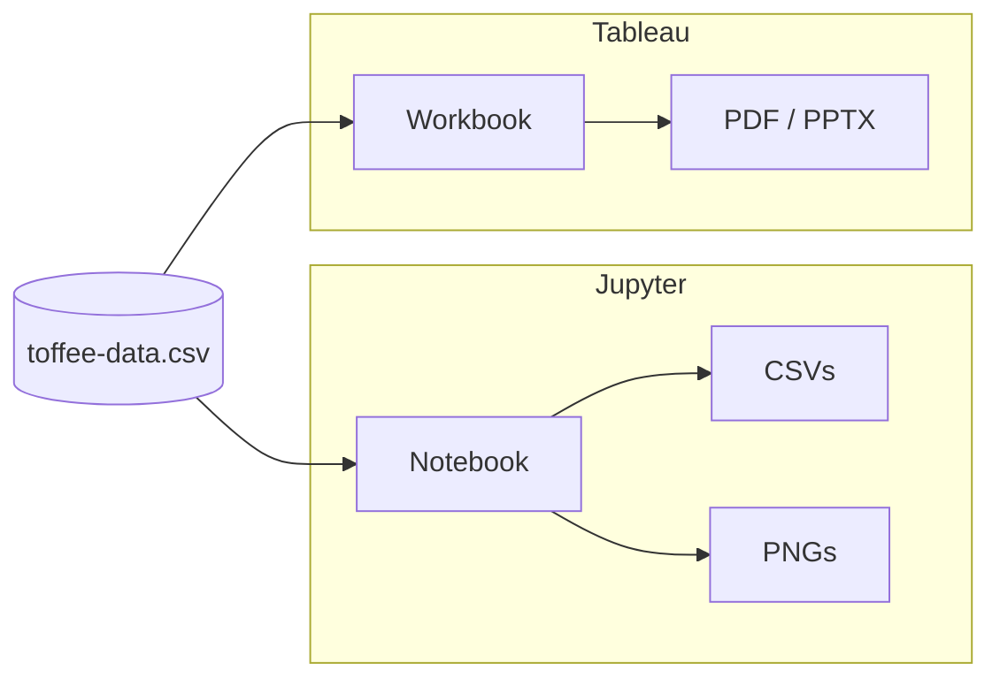
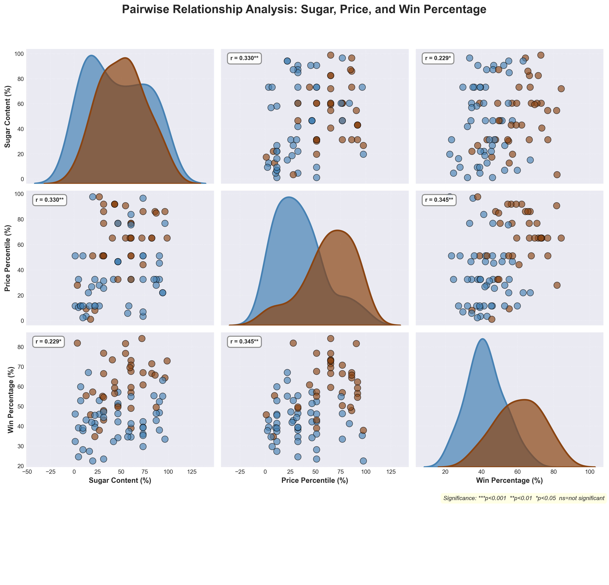
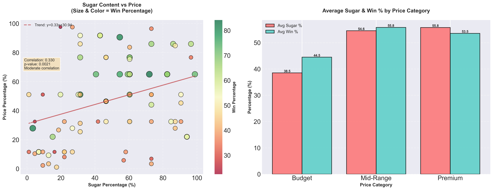
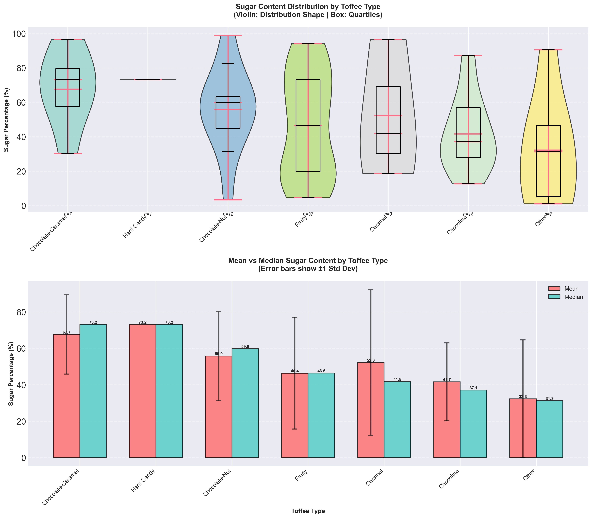
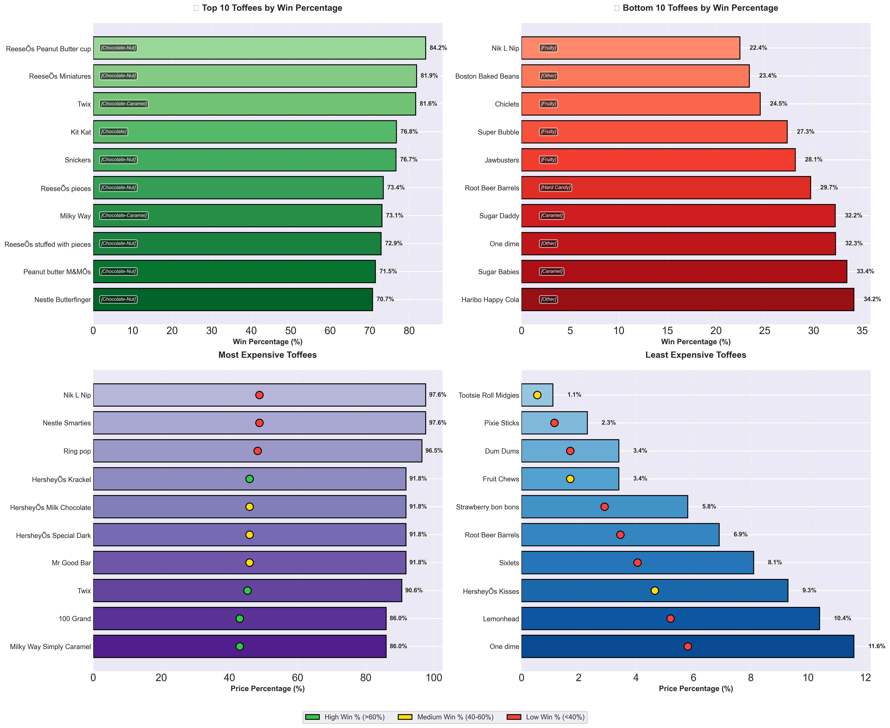
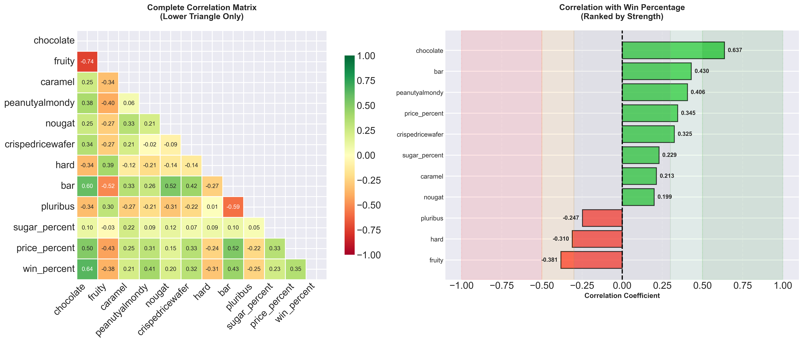
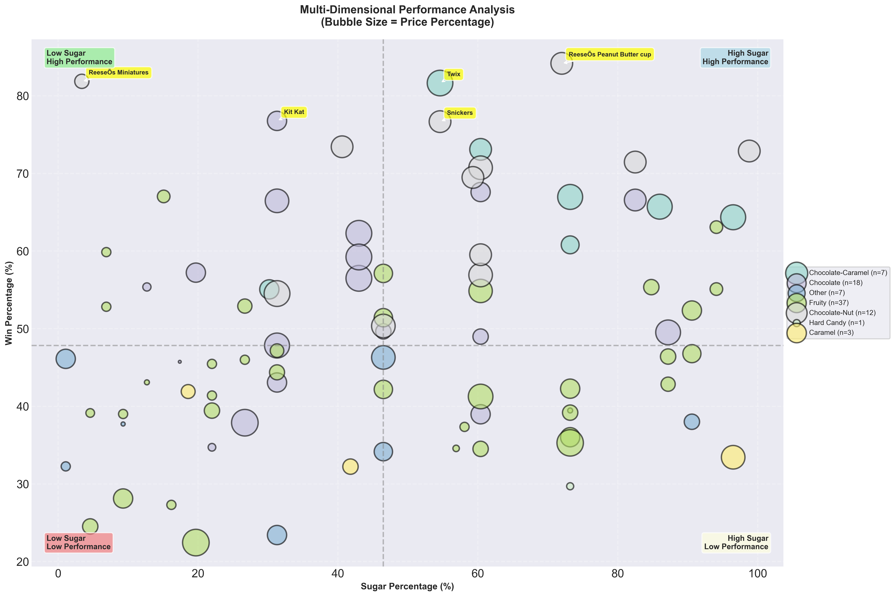
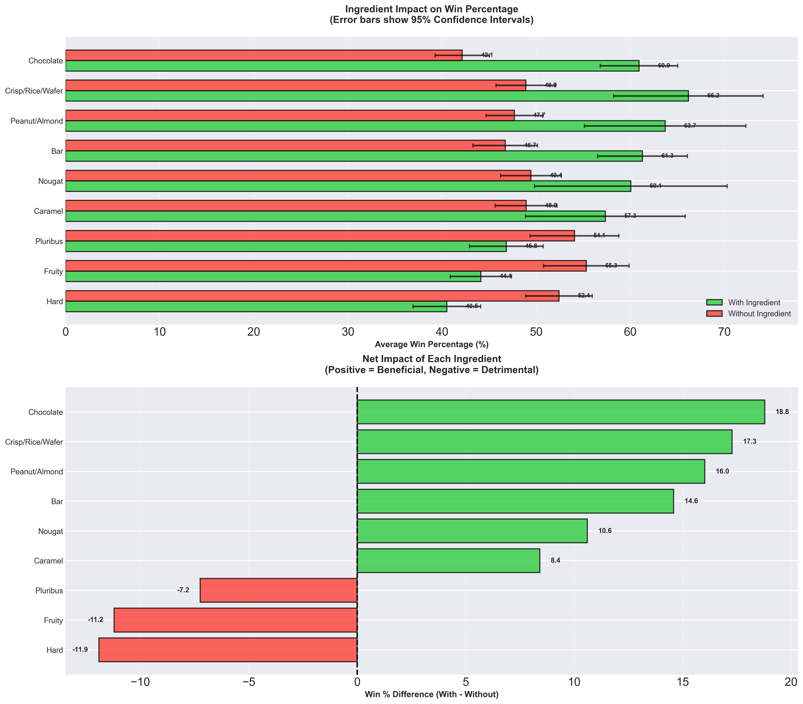
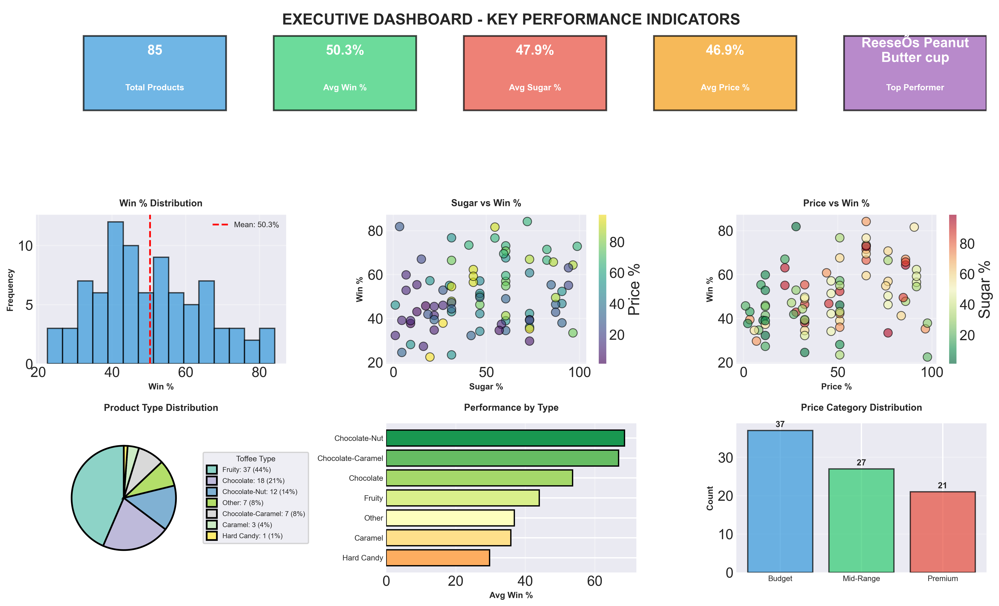
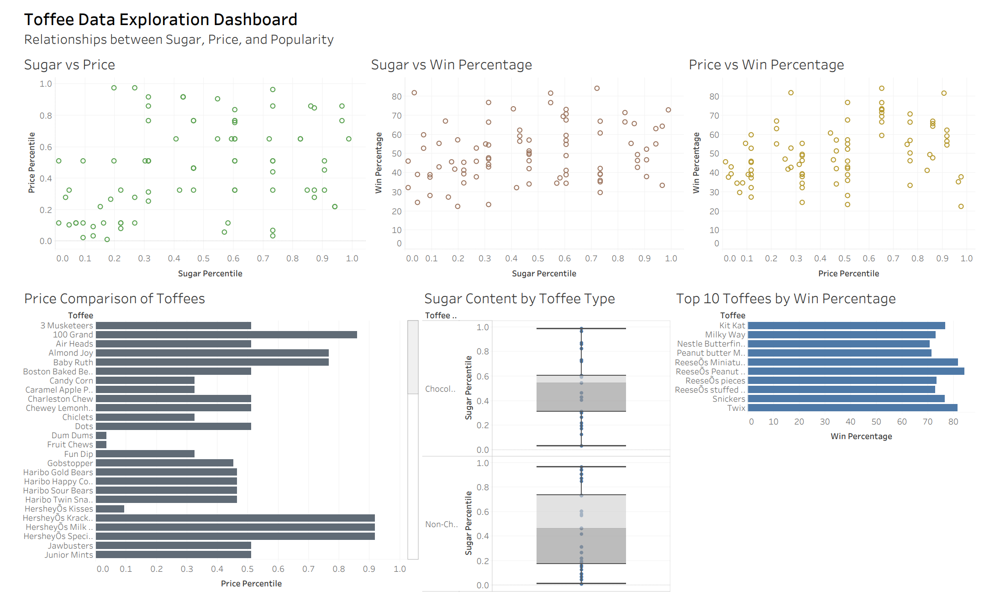

# Comprehensive Toffee Data Analysis

**Author:** Muhammad Nouman Hafeez  
**Data:** 86 toffees · 13 attributes · Sugar, price & win-percent analysis

---

## Project Overview

This project explores what makes certain candies more popular than others using the same analysis in **two implementations**:

| Implementation | Tools | Deliverables |
|----------------|--------|---------------|
| **Python / Jupyter** | pandas, matplotlib, seaborn, scipy | Notebook, CSVs, PNG visualizations |
| **Tableau** | Tableau Desktop | Interactive workbook, dashboard PDF, PowerPoint deck |

Both approaches answer the same business questions: sugar vs price, type-based patterns, top performers, and ingredient impact on win percentage.

### Project & implementation workflow



---

## Repository Structure

```
heb/
├── toffee-data.csv                    # Source data (86 products)
├── toffee_analysis.ipynb              # Jupyter notebook (full Python analysis)
├── analysis_results/                  # CSV outputs from notebook
│   ├── toffee_analysis_summary.csv
│   ├── correlation_matrix.csv
│   └── ingredient_impact_analysis.csv
├── outputs/                           # PNG visualizations from notebook
│   ├── 01_pairplot_analysis.png
│   ├── 02_sugar_vs_price_analysis.png
│   ├── 03_sugar_by_type.png
│   ├── 04_top_bottom_performers.png
│   ├── 05_correlation_analysis.png
│   ├── 06_multidimensional_analysis.png
│   ├── 07_ingredient_impact.png
│   └── 08_executive_dashboard_corrected.png
├── toffee-data-exploration.twb        # Tableau workbook (no extract)
├── toffee-data-exploration.twbx       # Tableau packaged workbook
├── dashboard.pdf                      # Tableau dashboard export
├── toffee-data-exploration.pptx       # Presentation deck
├── toffee-data-exploration.png        # Project/summary image
├── Assignment 1.pdf                   # Assignment brief
└── README.md
```

---

## Implementation 1: Jupyter Notebook (Python)

### Setup & Run

**Prerequisites:**
```bash
pip install pandas numpy matplotlib seaborn scipy jupyter
```

**Run analysis:**
1. Open the notebook: `jupyter notebook toffee_analysis.ipynb`
2. Run all cells (e.g. **Cell → Run All**).
3. Figures are saved under `outputs/`; CSVs under `analysis_results/`.

### Visualizations (PNG)

| # | Chart | Description |
|---|--------|-------------|
| 1 | Pair plot | Sugar, price, and win % relationships |
| 2 | Scatter + regression | Sugar vs price correlation |
| 3 | Box & violin | Sugar by toffee type |
| 4 | Horizontal bars | Top/bottom performers & price extremes |
| 5 | Correlation heatmap | All variables vs win % |
| 6 | Bubble chart | 4D: sugar, win %, price (size), type (color) |
| 7 | Grouped bars + CI | Ingredient impact on win % |
| 8 | Executive dashboard | One-page summary |

**Rendered outputs:**

**1. Pair plot — relationships between sugar, price, and win %**



**2. Sugar vs price analysis**



**3. Sugar content by toffee type**



**4. Top & bottom performers and price extremes**



**5. Correlation analysis**



**6. Multidimensional (4D) analysis**



**7. Ingredient impact on win %**



**8. Executive dashboard**



---

## Implementation 2: Tableau

The same analysis and story are delivered in Tableau for interactive exploration and sharing.

| File | Description |
|------|-------------|
| **toffee-data-exploration.twb** | Workbook linked to `toffee-data.csv` (no embedded data) |
| **toffee-data-exploration.twbx** | Packaged workbook (data embedded) — use this if you don’t have the CSV |
| **dashboard.pdf** | Exported dashboard for reports |
| **toffee-data-exploration.pptx** | Presentation version of the analysis |
| **toffee-data-exploration.png** | Summary/project image |

**Project overview image (Tableau):**



**How to use:**
- **Tableau Desktop:** Open `toffee-data-exploration.twbx` (or `.twb` with `toffee-data.csv` in the same folder).
- **Sharing:** Use the `.twbx` for colleagues; use `dashboard.pdf` or `.pptx` for reports and presentations.

---

## CSV Results Summary

### 1. Toffee analysis summary (`analysis_results/toffee_analysis_summary.csv`)

Per-product metrics: `competitorname`, `toffee_type`, `sugar_percent`, `price_percent`, `win_percent`, `performance` (High Performer / Average / Low Performer).

**Sample (top 5 by win %):**

| competitorname | toffee_type | sugar_percent | price_percent | win_percent | performance |
|---------------|-------------|---------------|---------------|-------------|-------------|
| Reese's Peanut Butter cup | Chocolate-Nut | 72.0 | 65.1 | 84.18 | High Performer |
| Reese's Miniatures | Chocolate-Nut | 3.4 | 27.9 | 81.87 | High Performer |
| Twix | Chocolate-Caramel | 54.6 | 90.6 | 81.64 | High Performer |
| Kit Kat | Chocolate | 31.3 | 51.1 | 76.77 | High Performer |
| Snickers | Chocolate-Nut | 54.6 | 65.1 | 76.67 | High Performer |

Full file: [analysis_results/toffee_analysis_summary.csv](analysis_results/toffee_analysis_summary.csv)

---

### 2. Correlation matrix (`analysis_results/correlation_matrix.csv`)

Correlations between all numeric and binary variables (ingredients, sugar %, price %, win %).

**Selected correlations with `win_percent`:**

| Variable | Correlation with win_percent |
|----------|------------------------------|
| chocolate | **0.637** |
| bar | 0.430 |
| peanutyalmondy | 0.406 |
| price_percent | 0.345 |
| crispedricewafer | 0.325 |
| nougat | 0.199 |
| caramel | 0.213 |
| sugar_percent | 0.229 |
| pluribus | -0.247 |
| hard | -0.310 |
| fruity | -0.381 |

Full file: [analysis_results/correlation_matrix.csv](analysis_results/correlation_matrix.csv)

---

### 3. Ingredient impact analysis (`analysis_results/ingredient_impact_analysis.csv`)

Average win % for toffees **with** vs **without** each ingredient, and the difference (with standard deviations and counts).

| ingredient | with | without | difference | with_n | without_n |
|------------|------|---------|------------|--------|-----------|
| chocolate | 60.92 | 42.14 | **+18.78** | 37 | 48 |
| crisp/rice/wafer | 66.17 | 48.89 | **+17.28** | 7 | 78 |
| peanut/almond | 63.70 | 47.68 | **+16.02** | 14 | 71 |
| bar | 61.30 | 46.71 | **+14.58** | 21 | 64 |
| nougat | 60.05 | 49.44 | +10.61 | 7 | 78 |
| caramel | 57.35 | 48.93 | +8.42 | 14 | 71 |
| pluribus | 46.82 | 54.07 | -7.24 | 44 | 41 |
| fruity | 44.12 | 55.33 | -11.21 | 38 | 47 |
| hard | 40.51 | 52.42 | -11.91 | 15 | 70 |

Full file: [analysis_results/ingredient_impact_analysis.csv](analysis_results/ingredient_impact_analysis.csv)

---

## Analysis Objectives (Both Implementations)

1. **Relationship analysis** — How sugar %, price %, and win % relate.
2. **Sugar vs price** — Correlation between sugar content and pricing.
3. **Type-based sugar** — Which toffee types have highest sugar.
4. **Top performers** — Which toffees win most in comparisons.
5. **Characteristic correlations** — Which ingredients/features predict popularity.
6. **Value** — Which toffees offer the best value (win % vs price).

---

## Visualization Techniques (Notebook)

| Technique | Purpose |
|-----------|---------|
| Pair plot | All pairwise relationships (sugar, price, win %) |
| Scatter + regression | Linear relationship and significance |
| Box & violin | Distribution of sugar by type |
| Horizontal bar charts | Rankings and price extremes |
| Correlation heatmap | Full variable relationships |
| Bubble chart | 4D: sugar, win %, price (size), type (color) |
| Grouped bars + 95% CI | Ingredient impact with uncertainty |
| Executive dashboard | One-page KPI and chart summary |

---

## Data & Conventions

- **Source:** `toffee-data.csv` — 86 products, 13 attributes.
- **Key columns:** `competitorname`, ingredient flags (chocolate, fruity, caramel, etc.), `sugarpercent`, `pricepercent`, `winpercent`.
- **Notebook:** Converts percentile fields to 0–100 scale; builds `toffee_type` and performance segments for analysis.

---

## Updating the Analysis

1. Replace `toffee-data.csv` with a new file (same column names and structure).
2. **Jupyter:** Re-run all cells; new PNGs and CSVs will be written to `outputs/` and `analysis_results/`.
3. **Tableau:** Reconnect the workbook to the new CSV (or refresh the data source in the `.twbx`).

---

## Limitations

- 86 products — may not represent the full market.
- Snapshot in time; no time series.
- Win % from pairwise comparisons, not absolute sales.
- Binary ingredients only (no quantities).
- No external factors (marketing, distribution).

---

## Version & Tools

| Item | Details |
|------|---------|
| **Version** | 1.0 |
| **Last updated** | 2024 |
| **Python stack** | Python 3.8+, pandas, numpy, matplotlib, seaborn, scipy |
| **Tableau** | Tableau Desktop (workbook + packaged workbook) |
| **Data** | toffee-data.csv — 86 products, 13 attributes |

---

*This analysis supports data-driven decisions on formulation, pricing, and portfolio. Use it together with domain expertise and business context.*
